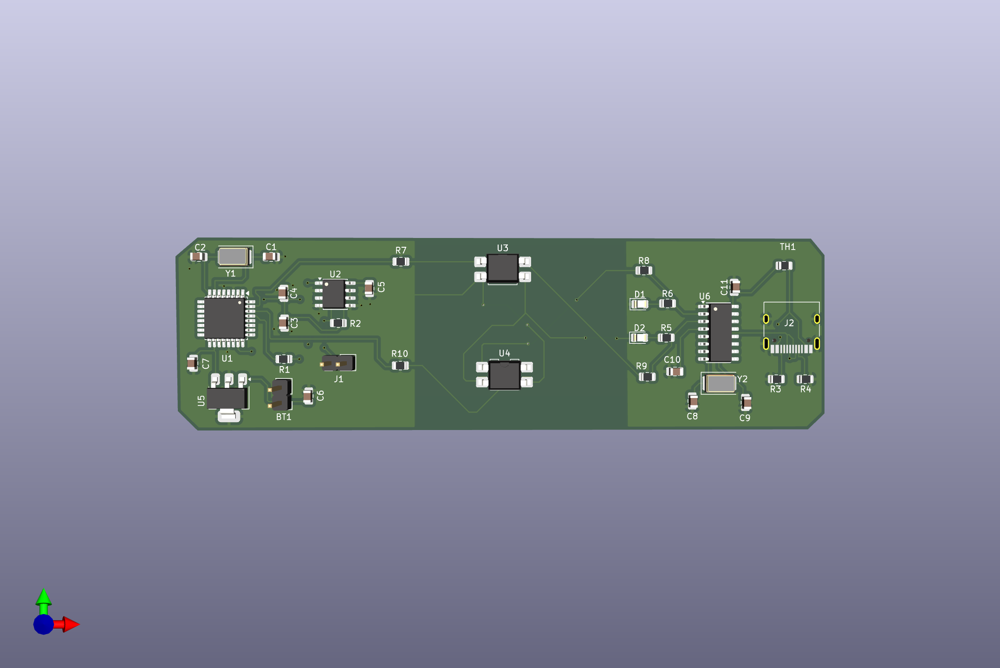
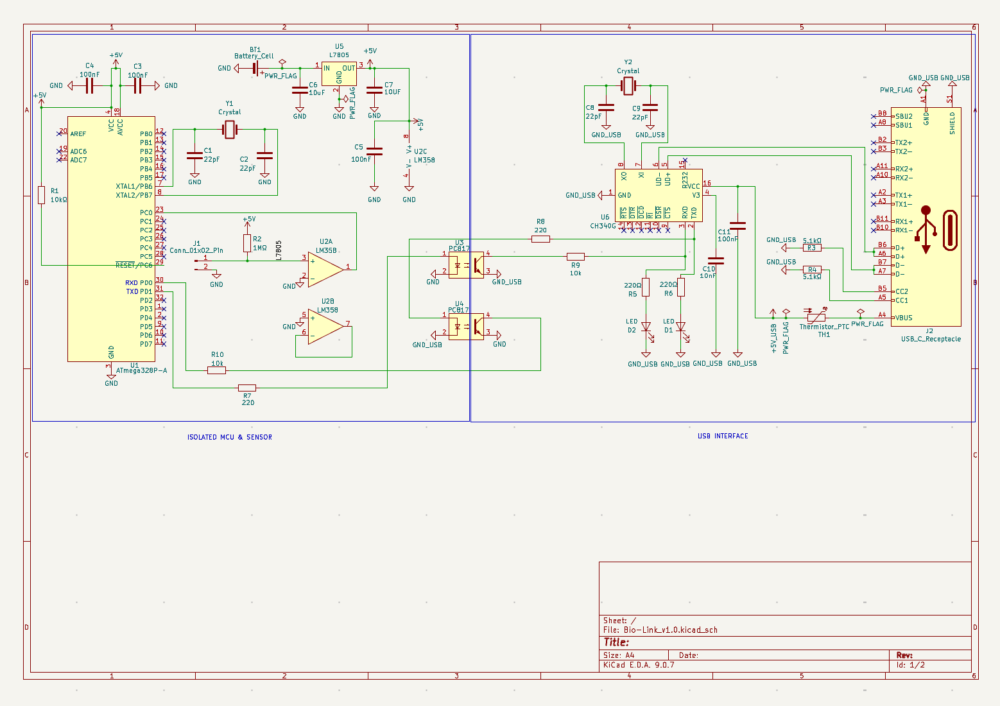
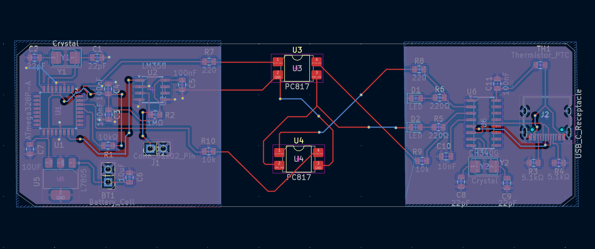

# Bio-Data-Bridge v1.0 🩺💻

**Bio-Data-Bridge**, insan vücudundan alınan hassas biyometrik sinyalleri (EKG, EMG veya diğer analog veriler) güvenli bir şekilde işlemek ve dijital ortama aktarmak için tasarlanmış, yüksek izolasyonlu bir **Biyometrik Veri Arayüzüdür**.

## 🚀 Projenin Amacı ve Kapsamı
Bu projenin temel odağı, insan vücudundan gelen mikrovolt seviyesindeki zayıf analog sinyallerin, dış gürültüden arındırılarak ve **elektriksel güvenlikten ödün vermeden** bilgisayara aktarılmasıdır. 

* **İnsan-Makine Arayüzü (HMI):** Kart üzerindeki özel konnektör yapısı, elektrotlar aracılığıyla doğrudan insan vücudundan veri alacak şekilde konfigüre edilmiştir.
* **Kullanıcı Güvenliği:** Kullanıcı ile doğrudan fiziksel temas olduğu için sistem, **PC817 optokuplörler** kullanılarak bilgisayarın şebeke geriliminden ve olası voltaj dalgalanmalarından tamamen izole edilmiştir.

## 🛠 Teknik Sinyal Hattı (Signal Chain)
1.  **Veri Toplama:** İnsan vücudundan gelen analog sinyaller ana giriş konnektörü üzerinden sisteme dahil olur.
2.  **Sinyal İşleme:** Mikrovolt seviyesindeki veriler, **LM358 Op-Amp** katmanında filtrelenir ve işlenebilir seviyeye yükseltilir.
3.  **İzolasyon ve Aktarım:** İşlenen veri, elektriksel izolasyon bariyerini geçerek **CH340G** USB-UART köprüsü üzerinden bilgisayara iletilir.
4.  **Kontrol:** Tüm süreç endüstri standardı **ATmega328P** mikrodenetleyicisi tarafından yönetilir.

## 📐 PCB Tasarım Özellikleri
* **Güvenlik Odaklı Layout:** İzolasyon bariyeri (Clearance/Creepage), kullanıcı güvenliğini en üst düzeyde tutacak şekilde tasarlanmıştır.
* **Özel Geometri:** Ergonomik kullanım ve estetik bir görünüm için **özel pahlı (chamfered)** kenar kesimi uygulanmıştır.
* **Sinyal Bütünlüğü:** Hassas analog hatlar, dijital gürültüden (EMI) korunması için PCB üzerinde optimize edilmiştir.
* **GND Copper Pour (Topraklama Alanı):** Sinyal bütünlüğünü artırmak ve gürültüyü minimize etmek amacıyla PCB'nin hem ön (F.Cu) hem de arka (B.Cu) yüzeyine geniş bakır alanlar (Copper Pour) eklenerek tüm toprak hatları optimize edilmiştir.

## 📁 Klasör İçeriği & Dokümantasyon
* `/Gerbers`: Fabrikasyon için hazır üretim (Gerber & Drill) dosyaları.
* `/Schematic`: Devre şeması ve tasarım detayları.
* **`Bio-Data-Bridge.csv` (BOM Listesi):** Projenin montajı için gereken tüm elektronik bileşenlerin (direnç, kapasitör, IC vb.) tam listesi, değerleri ve kılıf (footprint) bilgileri.
* `Bio-Data-Bridge.png`: Kartın 3D render görseli.

---

### 🛠 Kurulum ve Üretim
1.  **PCB Üretimi:** `Gerber` klasöründeki dosyaları herhangi bir PCB üreticisine gönderin.
2.  **Malzeme Tedariği:** `Bio-Data-Bridge.csv` dosyasını açarak gerekli tüm parçaları (BOM listesi) temin edin.
3.  **Montaj:** Şematik ve PCB layout takibiyle bileşenleri lehimleyin.
4.  **Veri Akışı:** USB üzerinden bağlantı kurarak biyometrik veri akışını izlemeye başlayın.

---
*Bu proje KiCad 8.0 kullanılarak geliştirilmiştir.*
